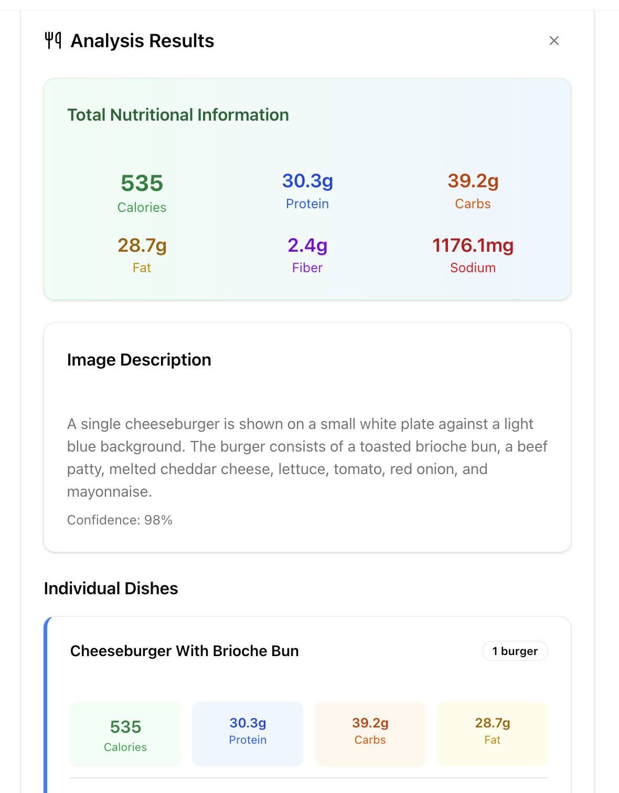

# Calorie Counter

[](https://uploader.sadmn.com)

A sleek web application that allows users to track their daily calorie intake and gain insights into their nutrition through a clean, intuitive interface.

Live Demo: [https://calorie-counter-ashen.vercel.app/](https://calorie-counter-ashen.vercel.app/)

---

## Table of Contents

1. [Overview](#overview)  
2. [Features](#features)  
3. [Tech Stack](#tech-stack)  
4. [Architecture & Workflow](#architecture--workflow)  
5. [Installation & Local Development](#installation--local‑development)  
6. [Deployment](#deployment)  
7. [Project Structure](#project‑structure)  
8. [Contributing](#contributing)  
9. [License](#license)

---

## Overview

This project is a modern calorie-counter web app, designed to help users log meals, monitor calorie intake, and maintain nutritional awareness with ease.

---

## Features

- **Upload your image**: Upload any image of any dish you'd like  
- **Count your calories**: Using GEMINI vision, track the total number of calories consumed per day.  
- **Find ways to burn off those calories**: Based on the number of calories, get exercises recommended!  

---

## Tech Stack

- **Frontend**: Built using Nextjs with Typescript + ShadCN for the sleek ui design  
- **Backend / API**: Gemini Vision for image detection, Uploadthing for file storage, Redis for key-value caching, Nutritionix for calories API
- **Deployment**: Hosted for pre-production on Vercel

---

## Future Plans
- integrate user sign in & account creation
- allow users to track their history and daily caloric intake with statistics
  - this might mean using supabase or Postgresql for storing user information

---

## Installation & Local Development

_To set up and run the project locally:_

```bash
# 1. Clone the repository
git clone https://github.com/ayastaga/calorie-counter.git
cd calorie-counter

# 2. Install dependencies
npm install
# or
yarn install

# 3. Start the development server
npm run dev
# or
yarn dev

# 4. Open http://localhost:3000 in your browser to view the app
